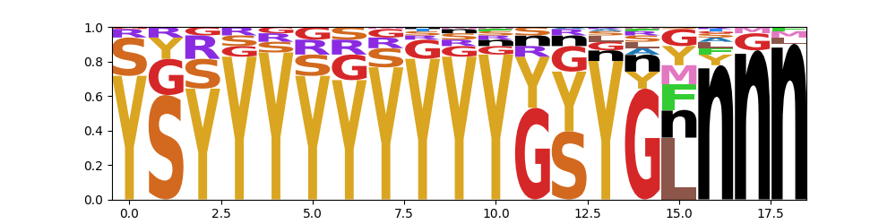

.. include:: includes.rst.txt
*********************************************
Tutorial: Generating a sequence logo plot
*********************************************
This document will walk through how to generate a frequency/probability-based logo plot from sequence data in the format of an input to *ortho_seqs*, using the *logo-plot* CLI command. The logo plot can provide information on the frequencies of nucleotides/amino acids present in your sequence dataset before running *orthogonal-polynomial*.

Logo plots are generated using the `logomaker package <https://logomaker.readthedocs.io/en/latest/>`_ in Python. More customization options exist (font, color schemes, etc) that are not (yet) implemented here.

.. _Necessities:
1. Requirements for *logo-plot*
-----------------------------------------------------------

The sequence data, `formatted <https://ortho-seqs.readthedocs.io/en/master/orthogonal_polynomial_tutorial.html#your-dataset>`_ as input to *ortho_seqs*. This can take the form of either:

+ .txt file: single file containing sequences, separated by line breaks.

+ .csv or .xlsx file: single file containing sequence data in the first column. Can (but doesn't have to) contain phenotype data in the second column.

.. _Flags:
2. *logo-plot* flags:
-----------------------------------------------------------

*logo-plot* will require the following flags.

.. code-block:: shell-session

  --filename

This will be the sequence data file, formatted as described in (1).

.. code-block:: shell-session

  --molecule

This is the molecule type. Should either be DNA, RNA, or protein. Default is DNA.

.. code-block:: shell-session

  --out_dir

This is where you want the logo plot to be stored.

.. _Running:
3. Running *logo-plot*:
-----------------------------------------------------------

You will run *logo-plot* in the CLI the same way you would run *orthogonal-polynomial* or *rf1d-viz*. The general format is:

.. code-block:: shell-session

    ortho_seq logo-plot filename --molecule --out_dir

.. _Example:
4. Guided example with test dataset:
-----------------------------------------------------------

The example uses the Sidhu dataset that has also been used in the other tutorials.

The sequence data that will be used for this example is called *sidhu_insulin_cdrh3_seqs.xlsx*. Given that this dataset is about proteins, our CLI input will be

.. code-block:: shell-session

    ortho_seq logo-plot docs/source/sidhu_insulin_cdrh3_seqs.xlsx --molecule protein --out_dir docs/source/tutorial_outputs/

The saved figure will look like:

