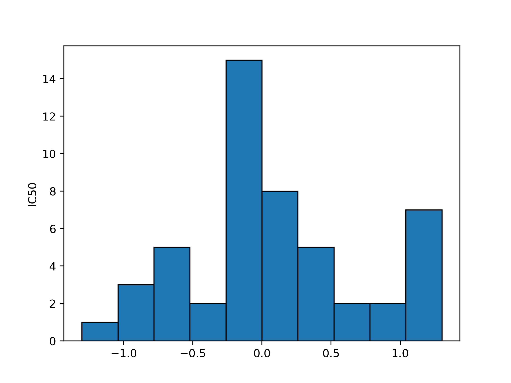
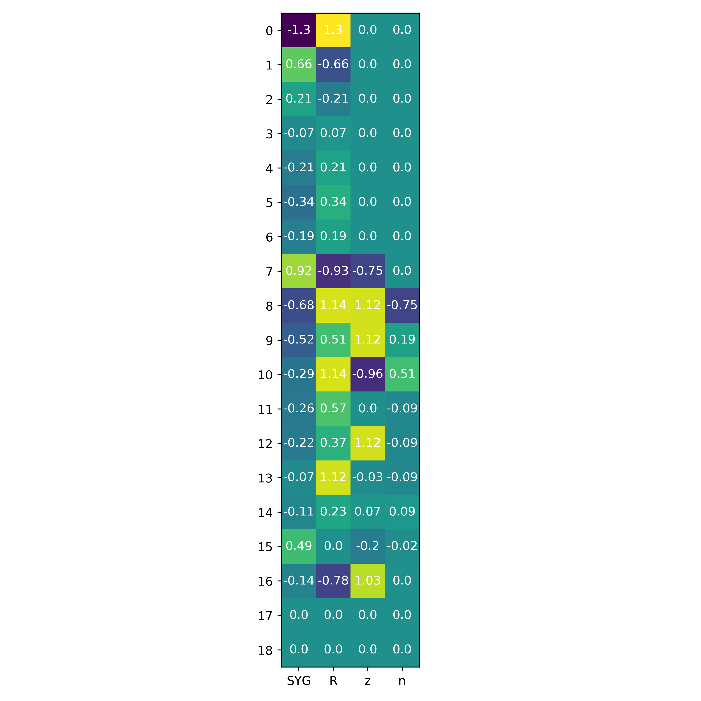
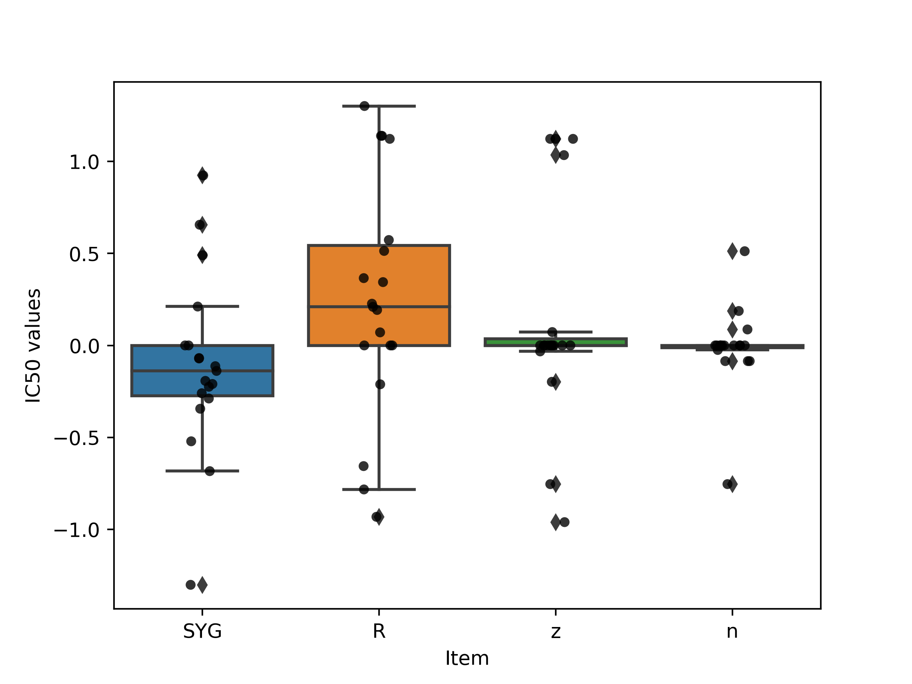

.. include:: includes.rst.txt
*********************************************
Tutorial: Visualizing your rFon1D results
*********************************************
This document will walk you through the steps of how to visualize your rFon1D outputs from *ortho_seqs* using the *rf1d-viz* CLI command.

  **Note:** *rf1d-viz* assumes that you have already run *orthogonal_polynomial* on the dataset. For a tutorial on how to run *orthogonal_polynomial*, view the tutorial `here <https://github.com/snafees/ortho_seqs/blob/plot/docs/source/orthogonal_polynomial_tutorial.rst>`_.

.. _Necessities:
1. Requirements for *rf1d-viz*
-----------------------------------------------------------

+ The *{trait_file_name}_regressions.npz* file that is returned from *orthogonal-polynomial*.

+ The *rf1d* form of the alphabet input.

When you run *orthogonal-polynomial*, the CLI will output the following text towards the beginning:

.. code-block:: shell-session

  rf1d form of alphabet input:

The line **beneath** that line is the *rf1d* form of the alphabet input.

+ The molecule type of the sequence (mostly *DNA* or *protein*).

+ What the phenotype values are representing.

.. _Flags:
2. *rf1d-viz* flags:
-----------------------------------------------------------

*rf1d-viz* will require you to input the following flags, many of which have counterparts in *orthogonal-polynomial*:

.. code-block:: shell-session

  --filename

This will be the *{trait_file_name}_regressions.npz* file that is returned from *orthogonal-polynomial*.

.. code-block:: shell-session

  --alphbt_input

This will be the *rf1d* form of the alphabet input.

.. code-block:: shell-session

  --molecule

This is the molecule type.

.. code-block:: shell-session

  --phenotype

This is the phenotype type. It will be used for labelling the graphs.

.. code-block:: shell-session

  --out_dir

This is where you want the graphs stored. **Note:** the path must exist prior to running *rf1d-viz*.

.. code-block:: shell-session

  --action

This is where you specify what kind of visualization you want. The current options are:

1. *barplot* - This will create a barplot of the rFon1D values, grouped by site and alphabet input. This is called automatically when you run *orthogonal-polynomial*.
2. *histogram* - This will create a histogram of the rFon1D values.
3. *summary* - Prints out the number of sites and dimensions, the alphabet input, the molecule, and calls *sort* (another *rf1d-viz* action that is explained in further detail below). This is called in *orthogonal-polynomial* automatically, and will not be saved.
4. *heatmap* - This will create a heatmap of the rFon1D values, grouped by site and alphabet input.
5. *boxplot* - This will create a boxplot of the rFon1D values, grouped by .
6. *sort* - This will print out the top 10 rFon1D values by magnitude, including the rFon1D value, the site, and the group it belongs to. This will not be saved to the *out_dir*.

.. _input:
3. Running *rf1d-viz*
-----------------------------------------------------------

Similarly to *orthogonal-polyomial*, you will run *rf1d-viz* in your CLI, first starting with the keyword *ortho_seq*, but now followed by *rf1d-viz*, instead of *orthogonal-polynomial*. The general format is

.. code-block:: shell-session

  ortho_seq rf1d-viz filename --alphbt_input --molecule --phenotype --out_dir --action

*filename* represents the *--filename* flag.

.. _example:
Guided example with the Sidhu dataset
-----------------------------------------------------------

The example uses the *Sidhu* dataset, which is the same as was used for the *orthogonal-polynomial* tutorial. Recall that the input for *orthogonal-polynomial* was:

.. code-block:: shell-session

  ortho_seq orthogonal-polynomial ortho_seq_code/Sidhu/Sidhu.xlsx --molecule protein --poly_order first --out_dir docs/source/tutorial_outputs --alphbt_input SYG,R --min_pct 40 --pheno_name IC50

The regression file that will be used for *rf1d-viz* will thus be called

.. code-block:: shell-session

  Sidhu_regressions.npz

Using the CLI output, we obtain

.. code-block:: shell-session

  rf1d form of alphabet input:
  SYG,R,z,n

which reveals that the *rf1d* form of the alphabet input is **SYG,R,z,n**.

With these in mind, the CLI input for *rf1d-viz* for a **barplot** will be

.. code-block:: shell-session

  ortho_seq rf1d-viz docs/source/tutorial_outputs/Sidhu_regressions.npz --alphbt_input SYG,R,z,n --molecule protein --phenotype IC50 --out_dir docs/source/tutorial_outputs --action barplot

This line of code will reproduce the graph that is automatically run, and looks like

.. image:: tutorial_outputs/rFon1D_Regressions_of_IC50_values.png
  :height: 250px

Notice how the y axis is labelled with the phenotype name specified

The CLI input for *rf1d-viz* for a **histogram** will be

.. code-block:: shell-session

  ortho_seq rf1d-viz docs/source/tutorial_outputs/Sidhu_regressions.npz --alphbt_input SYG,R,z,n --molecule protein --phenotype IC50 --out_dir docs/source/tutorial_outputs --action histogram

The graph looks like

Run *summary* with

.. code-block:: shell-session

  ortho_seq rf1d-viz docs/source/tutorial_outputs/Sidhu_regressions.npz --alphbt_input SYG,R,z,n --molecule protein --phenotype IC50 --out_dir docs/source/tutorial_outputs --action summary

The output will be

.. code-block:: shell-session

  rf1d Object:

  Number of sites: 19
  Number of dimensions: 4
  Alphabet input: ['SYG', 'R', 'z', 'n']
  Molecule: protein

  Phenotype represents IC50 values
  Image output directory: docs/source/tutorial_outputs
  Highest rFon1D magnitudes:
  -1.3014	Site: 0		Key: SYG
  1.3014	Site: 0		Key: R
  1.1394	Site: 8		Key: R
  1.1394	Site: 10		Key: R
  1.1229	Site: 9		Key: z
  1.1229	Site: 12		Key: z
  1.1229	Site: 8		Key: z
  1.1229	Site: 13		Key: R
  1.0344	Site: 16		Key: z
  -0.9606	Site: 10		Key: z

The CLI input for *rf1d-viz* for a **heatmap** will be

.. code-block:: shell-session

  ortho_seq rf1d-viz docs/source/tutorial_outputs/Sidhu_regressions.npz --alphbt_input SYG,R,z,n --molecule protein --phenotype IC50 --out_dir docs/source/tutorial_outputs --action heatmap

The graph looks like

The CLI input for *rf1d-viz* for a **boxplot** will be

.. code-block:: shell-session

  ortho_seq rf1d-viz docs/source/tutorial_outputs/Sidhu_regressions.npz --alphbt_input SYG,R,z,n --molecule protein --phenotype IC50 --out_dir docs/source/tutorial_outputs --action boxplot

The graph looks like

Lastly, this is the input for **sort**:

.. code-block:: shell-session

  ortho_seq rf1d-viz docs/source/tutorial_outputs/Sidhu_regressions.npz --alphbt_input SYG,R,z,n --molecule protein --phenotype IC50 --out_dir docs/source/tutorial_outputs --action sort

The output will be

.. code-block:: shell-session

  -1.3014	Site: 0		Key: SYG
  1.3014	Site: 0		Key: R
  1.1394	Site: 8		Key: R
  1.1394	Site: 10		Key: R
  1.1229	Site: 9		Key: z
  1.1229	Site: 12		Key: z
  1.1229	Site: 8		Key: z
  1.1229	Site: 13		Key: R
  1.0344	Site: 16		Key: z
  -0.9606	Site: 10		Key: z

As you can see, this prints out the second half of the *summary* output, since *summary* calls *sort*.
