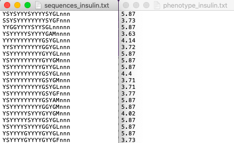
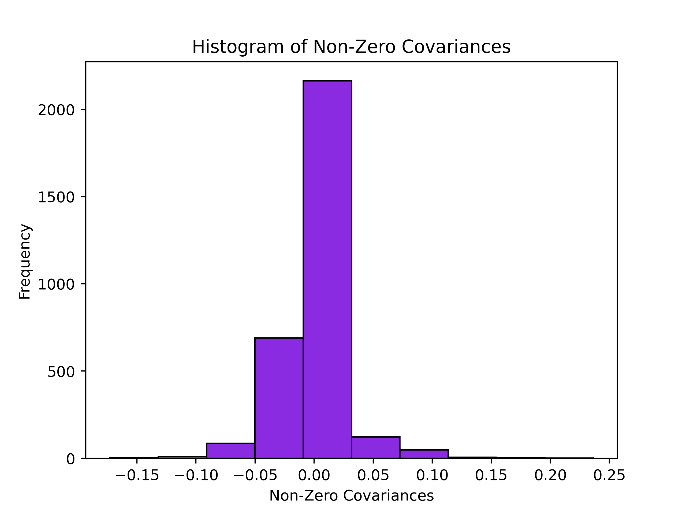
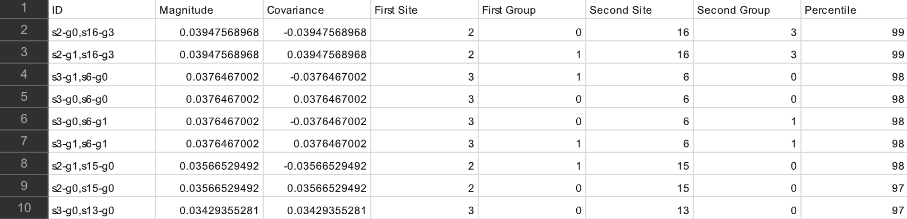
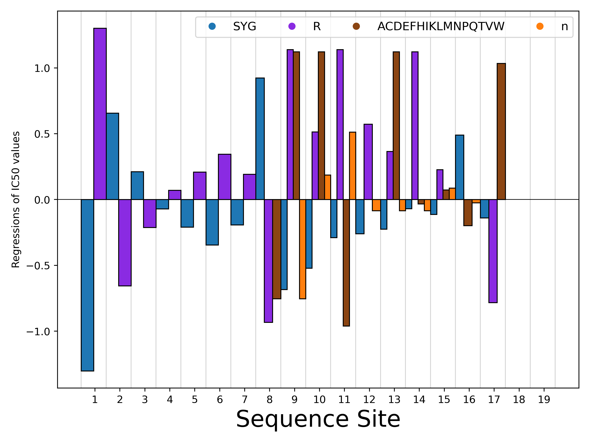

.. include:: includes.rst.txt
*********************************************
Tutorial: Running a sample dataset (protein sequences)
*********************************************
This document will walk you through the steps of how to run a dataset on ortho_seqs, and what the various outputs are.
This tutorial uses protein sequence data from *The Intrinsic Contributions of Tyrosine, Serine, Glycine, and Arginine
to the Affinity and Specificity of Antibodies* by Birtalan & Sidhu et al., 2008.

.. _downloads:
1. Setting Up Your Computer to Run ortho_seqs
-----------------------------------------------------------

The first thing you have to do (aside from gathering data!) is set up your computer to run ortho_seqs.

  You first need to have Miniconda installed on your computer, in order to do the shell commands. To do so, follow the link `here <https://docs.conda.io/en/latest/miniconda.html>`_, and choose the appropriate version, with regards to your computer.

After you have installed Minoconda, open up Terminal, or an equivalent Command-Line Interface (CLI). Run either this:

.. code-block:: shell-session

  conda create -n ortho_seqs pip
  conda activate ortho_seqs
  pip install -r requirements.txt

Or, alternatively:

.. code-block:: shell-session

  conda env create -f conda_environment.yml
  conda activate ortho_seqs

To activate ortho_seqs on your device. You will also need to run:

.. code-block:: shell-session

  conda install openpyxl
  python setup.py install

This line must be run every time ortho_seqs is updated, so you are using the most recent version. If the above steps have worked, congrats! You now have ortho_seqs on your computer. It's time to input some data.

.. _dataset_input:
2. Your dataset
-----------------------------------------------------------

The data that is input to ortho_seqs must include a column of sequences, and a column of their corresponding phenotype values. These two columns can either be separate .txt files, or a single .xlsx or .csv file. Take, for instance, our toy example, which is a dataset originating from a paper titled `The Intrinsic Contributions of Tyrosine, Serine, Glycine, and Arginine to the Affinity and Specificity of Antibodies <https://www.sciencedirect.com/science/article/pii/S0022283608001691?casa_token=Qs608NJVJggAAAAA:-PruJ8_0_3pBtf4NHSVo0POYtzErFcDoqJYMxJQZER51_uZNtRYvBoWIMa9j3oIZJ18uY0rS3g>`_ by Sidhu et al. In this work, the authors constructed synthetic antibody Fab libraries to measure the impact of four different amino acids, Tyr, Ser, Gly and Arg on antigen recognition.
Affinity and specificity data for these antigen-binding Fabs is provided for 3 different antigens (insulin, VEGF, and HER2). For this tutorial, we look at CDRH3 sequences of Fabs binding to insulin, along with corresponding phenotypes which is given by Specificity ELISA Signal Optical Density (see Figure 4a in the paper). This will be referred to as the "Sidhu dataset" for this tutorial. The dataset, when input into ortho_seqs, should look like

or

.. image:: sidhu_xlsx_image.png
  :width: 250px
  :height: 250px

Note that for .xlsx (and .csv) files, the first column must be the sequences, and the second column must be the phenotypes. In addition, there must not be any header names for any files.

.. _parameter_definitions:
3. Executing Ortho_Seqs
-----------------------------------------------------------

We now turn towards our CLI to execute ortho_seqs.
Using the Sidhu dataset, our input would look like:

.. code-block:: shell-session

  ortho_seq orthogonal-polynomial ortho_seq_code/tests/data/nucleotide/onefile_tests/sidhu.xlsx --molecule protein --poly_order first --out_dir ../onefile_tests/sidhu --alphbt_input SYG,R --min_pct 40 --pheno_name IC50

Let's explore what these flags are, and how you can use them.

The file input (ortho_seq_code/.../sidhu.xlsx) is our sequence AND phenotype data.

.. code-block::

  --molecule

This flag is where you indicate what kind of molecule this is. This can be DNA, RNA, or protein. For the Sidhu dataset, the molecules are protein molecules.

.. code-block::

  --poly_order

This flag is to indicate the highest degree of polynomial order you want. Currently, DNA and RNA can go up to 2, and protein can only be 1. For the Sidhu dataset, we will look at first-order interactions.

.. code-block::

  --pheno_file

This flag is not in the example, because we don't need it. If you were to present your data as two separate .txt files, then this would be where you put the file path for the phenotype data, and the first file path is for your sequence data.

.. code-block::

  --out_dir

This flag indicates where you want the output files to go (more on what exactly is saved there later). If the folder path already exists, ortho_seqs will create a new directory with a very similar name, and it will tell you what the new path's name is.

.. code-block::

  --alphbt_input

(Note: "Characters" in the following section refer to the nucleotides for DNA, the bases for RNA, and all 21 amino acids for proteins, plus one additional character, "n", which indicates nothing is at that spot to deal with protein sequences of unequal lengths.)
This flag indicates the groupings of characters you want. The default will be no groupings, or every character gets counted on its own. If you include (uppercase) letters here, then only those characters will be used (every other character, except "n", gets converted to a "z" and treated as one group). If you comma-separate somewhere in that group, then characters will be grouped based on what comma(s) they are in between. For the Sidhu dataset, to show proof of concept, the groupings will be:

1. SYG \
2. R \
3. Everything else (z) \
4. n \

If we were to leave out the commas, the groups would be:

1. S
2. Y
3. R
4. G
5. Everything else (z)
6. n

.. code-block::

  --min_pct

One output will be an .xlsx file containing all of the first-order covariances between each amino acid at each side with another amino acid at another site. However, this file can get pretty big pretty quick. Therefore, this flag will only print out covariance values whose magnitudes are at or above the PERCENTILE value specified. The default is 75, meaning it will only save the covariances which range from the 75th to the 100th percentiles in magnitude. To keep it at the default, leave out this flag when inputting what you want. For the Sidhu dataset, we want all magnitudes at or above the 40th percentile (as proof of concept).

.. code-block::

  --pheno_name

The pheno_name will label the y axis of the rFon1D graph with whatever the phenotype value represents, if desired.

.. _outputs:
4. Obtained Outputs
-----------------------------------------------------------
+++++++++
CLI Outputs
+++++++++
The CLI will print out the g

+++++++++
Histogram and Spreadsheet of Covariances
+++++++++
The covariances between every character at every site with every other character at another site is recorded in a .csv file, and includes everything at or above the minimum percentile you specified in the input (or defaults to 75th percentile). In addition, the program outputs a histogram of the non-zero covariances, with the bin widths always being 0.5. For the Sidhu dataset, it looks like

And will have the file name cov_hist_{name}.png
The .csv file has 8 columns, and looks like:

They are:

1. ID: Useful for searching for a specific pairing. Ordering will be s{Site 1)-g{Group 1}, s{Site 2)-g{Group 2}. For example, s1-g2,s10-g8 refers to the pairing between Group 2 at Site 1, and Group 8 at Site 10.
2. Magnitude: Absolute value of the covariance value, used to assign percentile values and plot histogram.
3. Covariance: The obtained covariance value.
4. First Site: The site of one of the groups of the covariance pairing. Site 1 for ID column.
5. First Group: The group the character belongs to, identifiable through the --alphbt_input dictionary. Group 1 for ID Column.
6. Second Site: The site of the other group of the covariance pairing. Site 2 for ID column.
7. First Group: The group the character belongs to, identifiable through the --alphbt_input dictionary. Group 2 for ID Column.
8. Percentile: The percentile the respective magnitude is, relative to the entire dataset (including magnitudes that were omitted from the .csv file).

E.g., in our case, say we have a value of -.051 for the covariance corresponding to s1-g1,s5-g2.
This means that the group SYG at site 1 covaries negatively with an Arg at site 5.
This covariance analysis tells us things about the statics of the sequence space. At this point, we have not projected our phenotype onto the sequence space.
Here, we can discover patterns of covariation between amino acids at a given site with amino acids at other sites. When looking at the distribution of the magnitude of covariances, we can identify the ones at the tail ends
of this distribution. This information is denoted in the output csv and the allows for the identification of highly covarying (negative or positive) sites.

+++++++++
rFon1D Graph
+++++++++

The main result for the first order analysis is the regression of the phenotype (in this case, ELISA values) onto the first order conditional polynomial (denoted as rFon1D). This tells us the effect of having
a given amino acid at one site independent of its correlations with other amino acids at other sites.
Here, we can use this result to understand the independent effects of a given amino acid at a given site on the phenotype.

One output is a graph of the nonzero rFon1D values. For the Sidhu dataset, it looks like

At the bottom, it lists the dictionary of the groups and their corresponding number, which then can be used to determine which color bar belongs to which group.
The rFon1D graph will always have the name rFon1D_graph_{name}.png. The rFon1D values can also be found in the _regressions.npz file which can be opened up by the user in a jupyter notebook for further visualization.
